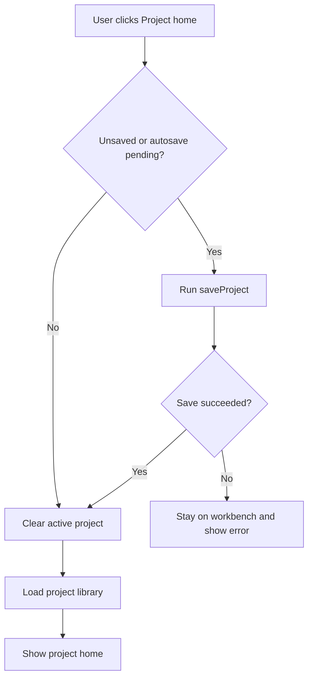

# Project Home Navigation Design

## Context

The app now uses an internal project library instead of direct project file
open/save dialogs. That makes the project home a permanent part of the product,
not a first-run-only screen.

The current workbench has no way to return to the project home. This is not only
a missing button. It breaks the mental model of a project-based desktop tool:
users can enter a project, but they cannot confidently leave it, switch
projects, or verify that the current work was saved before leaving.

## References

- Toss Tech article on user-perspective assumptions: maker-side assumptions can
  be invisible or confusing to users.
  https://toss.tech/article/thinking-user-perspective
- Toss Tech article on design-system component quality: repeated UI cases
  should be patterned, and long text, accessibility, and consistency should be
  handled at the component/spec level.
  https://toss.tech/article/toss-design-system
- Toss Tech article on rethinking design systems: product flows should work as
  guardrails, not rigid walls, and should support realistic exceptions.
  https://toss.tech/article/rethinking-design-system
- CVAT, Label Studio, and Roboflow use a common structure of project/task
  dashboard to annotation editor and back to project/task context.
  https://docs.cvat.ai/docs/
  https://labelstud.io/guide/setup_project
  https://docs.roboflow.com/annotate/use-roboflow-annotate

## User Goals

The primary user is building object detection training data. Their goal is not
to manage files. Their goal is to keep labeling momentum while trusting that
project state is preserved.

The navigation design must support these intentions:

- Start from a project list and choose work quickly.
- Return to the project list without wondering whether work was saved.
- Switch to another project without learning a file-open workflow.
- Understand when the source image folder needs attention.
- Avoid modal interruptions during repetitive labeling.
- Recover safely if saving fails.

## Recommended Direction

Use a breadcrumb-like project context pattern:

```text
Project Home > Current Project
```

The workbench should expose a clear `Project home` action in the top-left area.
It should behave like leaving a document in a modern productivity app:

1. If the project is already saved, return to the project home immediately.
2. If there are pending autosave changes, save first, then return.
3. If saving fails, stay on the workbench and show a clear error.

This keeps the workbench focused on labeling while making the larger project
library model discoverable and safe.

## Why This Beats a Simple Back Button

A simple back icon is ambiguous:

- It can mean browser history, previous image, close project, or cancel.
- It does not explain whether current annotations were saved.
- It does not fit a desktop labeling workflow where the project home is a
  workspace hub, not a previous page.

`Project home` is explicit. It names the destination and matches the internal
project library concept.

## Information Architecture

### Project Home

The project home remains the app entry point and the place for project
selection. It should show:

- Project name.
- Image count.
- Confirmed image count.
- Error image count.
- Last updated time.
- Missing source folder state when detectable.
- Project actions: rename and delete.

The project home should not expose raw project file paths. It may show source
folder health because that affects whether labeling can continue.

### Workbench

The workbench app bar should use this order:

1. `Project home` action.
2. Current project name.
3. Save status.
4. Image folder action.
5. Save action if manual save remains useful.
6. Undo/redo.
7. COCO export.

The left-most action should be stable and reachable. It should use an icon plus
text on desktop because this is a structural navigation action, not a compact
editing tool.

Recommended label:

```text
Project home
```

Recommended tooltip:

```text
Save and return to project home
```

## Save Status UX

The user needs lightweight reassurance, not another dialog.

Add a compact save status indicator near the project title:

- `Saved`
- `Saving...`
- `Save failed`

The indicator should be text plus an icon, not color alone.

Recommended behavior:

- After normal edits, autosave continues silently.
- While a save is in progress, show `Saving...`.
- After successful save, show `Saved`.
- On failure, show `Save failed` and keep the user on the workbench.

For MVP, this can be controller-backed with a small enum:

```text
idle/saved
saving
failed
```

The app does not need a detailed save history yet.

## Return To Home Flow



Important details:

- Do not ask for confirmation on every return. The app has autosave.
- Do not navigate away on save failure.
- Do not discard in-memory changes when save fails.
- Refresh the project library after returning so the list reflects the latest
  updated time and counts.

## Error Handling

Save failure message:

```text
Current changes could not be saved. Project home was not opened.
```

If the source image folder is missing, returning home should still be allowed
after project data saves. The source image folder is not the project data store.

If the project cannot be saved because the internal project file is missing or
locked, the user should remain in the workbench with annotations still in
memory. This is safer than returning to the project home and hiding the problem.

## Accessibility And Layout

- The `Project home` action must have a tooltip and semantic label.
- It should be keyboard reachable from the app bar.
- Text must not be icon-only because this action changes screen context.
- The save status must not rely on color alone.
- The app bar layout should tolerate long project names by truncating the title
  before pushing action buttons off screen.
- The design should work in Windows desktop widths used for labeling. Very
  narrow widths are out of scope for this MVP change, but the primary
  navigation must remain stable at normal desktop widths.

## State And API Design

Add a controller action:

```text
returnToProjectHome()
```

Responsibilities:

- Save the current project if needed.
- Clear the active project after a successful save.
- Clear selected image and box state.
- Reload project library entries.
- Notify listeners.

The app root can continue rendering based on `hasProject`.

Recommended controller state additions:

```text
SaveStatus saveStatus
Object? lastSaveError
```

Manual save and autosave should update the same save status. This makes the
workbench status meaningful regardless of which save path was used.

## Testing Plan

Controller tests:

- Returning home clears the active project after save.
- Returning home refreshes project library entries.
- Returning home keeps the project open if save fails.
- Save failure exposes an error state.

Widget tests:

- Workbench shows a `Project home` action.
- Tapping it returns to `project-home`.
- Save failure keeps the workbench visible and shows an error.
- Save status text changes for saved/saving/failed states where practical.

Regression checks:

- Existing project create/open flow still works.
- Existing autosave and manual save behavior still works.
- Existing export flow still works.

## Non-Goals

- Do not add multi-tab project switching in the workbench.
- Do not add a permanent project sidebar.
- Do not add a file-open workflow back into the app.
- Do not add frequent confirmation dialogs for normal home navigation.
- Do not copy or move source images.

## Acceptance Criteria

- A user can enter a project from the project home.
- A user can return to the project home from the workbench.
- Returning home saves first or confirms the latest saved state.
- Save failure prevents navigation and shows a clear message.
- Project home shows the updated project entry after return.
- The workbench app bar communicates both current project context and save
  status.
