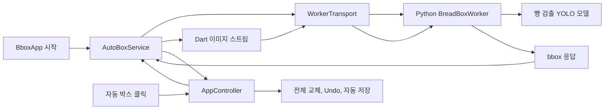

# 자동 박스 Worker 재설계

## 배경

현재 자동 박스 기능은 선택한 이미지 한 장을 Python sidecar로 분석하고,
성공한 결과로 해당 이미지의 기존 박스를 모두 교체한다. 기본 빵 detector는
persistent worker를 사용하도록 구현되어 있지만 worker 요청이 실패하면 예외와
stderr를 숨긴 채 일회성 detector로 전환한다. 이 경로에서는 Python 프로세스와
모델을 요청마다 다시 로드한다.

현재 프로젝트에서 사용하는 NAS UNC 이미지 경로는 Flutter 앱에서는 읽히지만
Python worker 프로세스에서는 열리지 않는 경우가 있다. 그 결과 worker가
종료되고 일회성 fallback이 반복되어 자동 박스를 누를 때마다 모델을 다시
불러오는 현상이 발생한다.

또한 현재 빵 파이프라인은 detector 이후 classifier와 선택적 CLIP 검증을
실행하지만 `AppController`가 모든 결과를 미라벨 proposal로 변환하기 때문에
분류 계산과 모델 로드가 제품 결과에 사용되지 않는다.

## 목표

- 앱 실행 직후 빵 검출 모델을 백그라운드에서 한 번 준비한다.
- 앱이 실행되는 동안 동일한 Python worker와 모델을 재사용한다.
- Flutter가 이미지 파일을 읽고 worker에는 이미지 바이트만 전달한다.
- NAS UNC, 한글, 공백, 긴 경로가 Python worker의 파일 접근 능력에 의존하지
  않게 한다.
- 자동 박스는 bbox 좌표와 detector confidence만 생성한다.
- worker 장애 시 한 번만 재시작하고 동일 요청을 한 번만 재시도한다.
- 최종 실패 시 기존 박스와 이미지 상태를 보존한다.
- 성공 시 기존 박스 전체 교체와 Undo 동작을 유지한다.
- FastSAM과 자동 분류 파이프라인을 제품 실행 및 배포 경로에서 제거한다.

## 비목표

- 자동 라벨을 지정하지 않는다.
- 여러 이미지를 동시에 추론하지 않는다.
- 이미지 가져오기 직후 폴더 전체에 자동 검출을 실행하지 않는다.
- 클라우드 추론, 모델 학습, 모델 선택 UI를 추가하지 않는다.
- COCO export 규칙이나 원본 이미지 좌표 저장 규칙을 변경하지 않는다.
- 개발용 연구 데이터나 분류 실험 산출물을 일괄 삭제하지 않는다.

## 핵심 결정

### 좌표 전용 검출

Python worker는 빵 검출 YOLO 모델 하나만 로드한다. classifier와 CLIP은
실행하지 않는다. 모든 결과는 Dart에서 `BoxStatus.proposal`과
`labelId: null`로 저장한다.

### 앱 수명의 persistent worker

worker는 프로젝트가 아니라 앱 수명에 속한다. 프로젝트를 닫거나 다른
프로젝트를 열어도 유지하며 앱이 종료될 때만 종료한다.

### Flutter가 이미지 데이터 제공

worker는 원본 경로를 받지 않는다. Dart가 JPEG, PNG 등 원본 파일의 압축된
바이트를 읽어 stdin으로 전달한다. Flutter에서 RGBA로 디코딩하거나 이미지를
재인코딩하지 않는다.

### 바이너리 framed protocol

Base64 JSON이나 localhost 서버 대신 stdin/stdout 길이-prefix 바이너리
프로토콜을 사용한다. 별도 포트와 방화벽 설정이 없고 Base64의 크기 증가와
문자열 복제를 피할 수 있다.

### 조용한 fallback 제거

worker 실패 시 일회성 Bread detector 또는 FastSAM으로 전환하지 않는다.
동일한 빵 worker를 한 번 재시작한 뒤에도 실패하면 사용자에게 오류를 알린다.

## 아키텍처



## 구성요소

### AutoBoxService

앱 전체에 하나만 존재하며 다음을 담당한다.

- 앱 시작 직후 `warmUp()` 호출
- 준비 및 실행 상태 관리
- 동시에 하나의 검출 요청만 허용
- Dart에서 이미지 파일 열기와 스트리밍
- worker 장애 분류, 재시작, 한 번의 재시도
- 앱 종료 시 worker 종료

상태는 다음과 같다.

```text
idle -> starting -> ready -> running -> ready
                      |         |
                      |         +-> restarting -> ready
                      |                         -> failed
                      +-> failed
```

동시에 여러 `warmUp()` 호출이 들어오면 같은 Future를 공유해 worker를 한 번만
시작한다.

### WorkerTransport

모델과 UI 정책을 모르는 프로세스 통신 계층이다.

- Python 프로세스 시작과 종료
- stdin 요청 frame 쓰기
- stdout 응답 frame 읽기
- protocol version과 request ID 검증
- timeout과 비정상 종료 감지
- 최근 stderr 최대 50줄 보관
- 테스트용 process starter 및 timeout 주입

### BreadBoxWorker

Python 장기 실행 프로세스다.

- 시작 시 빵 detector 모델 한 번 로드
- 모델 로드 완료 후 `ready` handshake 응답
- 이미지 payload를 메모리에서 디코딩
- detector 추론과 bbox 후처리
- bbox와 detector confidence 반환
- `shutdown` 요청 처리

### AppController

UI와 프로젝트 상태 변경만 담당한다.

- 실행 가능 조건 확인
- `AutoBoxService.detect()` 호출
- 성공 후에만 Undo 기록과 박스 교체
- 이미지 상태, 선택 박스, 자동 저장 갱신
- 실패 시 기존 프로젝트 상태 보존

Python 프로세스 생성, worker fallback, 바이너리 protocol 처리는 담당하지 않는다.

## 앱 시작과 준비

1. `BboxApp`이 화면 렌더링과 동시에 `AutoBoxService.warmUp()`을 비동기로
   호출한다.
2. 서비스가 Python worker를 시작한다.
3. worker가 빵 검출 모델을 로드한다.
4. worker가 framed `ready` 응답을 전송한다.
5. 서비스는 `ready`를 받은 뒤에만 준비 완료 상태로 전환한다.

프로세스 시작 성공만으로 모델 준비 완료를 판단하지 않는다. 사용자가 준비 중
자동 박스를 실행하면 새 worker를 만들지 않고 기존 warm-up Future를 기다린다.

`ready` 응답에는 요청 ID가 없으며 다음 형태를 사용한다.

```json
{
  "version": 1,
  "type": "ready",
  "detectorName": "bread-yolo-boxes",
  "model": "bread_yolov8n_1class_tray_v0_2.pt"
}
```

## 요청 프로토콜

모든 정수는 unsigned big-endian이다. 첫 버전의 protocol version은 `1`이다.

```text
4 bytes  JSON 헤더 길이
N bytes  UTF-8 JSON 헤더
8 bytes  이미지 payload 길이
M bytes  원본 이미지 파일 바이트
```

요청 헤더 예시:

```json
{
  "version": 1,
  "type": "detect",
  "requestId": "42",
  "fileName": "E0701.jpg"
}
```

`fileName`은 진단용 메타데이터이며 Python 파일 접근에 사용하지 않는다. Dart는
`File.length()`로 payload 길이를 얻고 `File.openRead()` chunk를 stdin으로
전달한다. Base64 문자열이나 전체 이미지 문자열을 만들지 않는다.

제어 요청인 `shutdown`은 같은 JSON 헤더 형식을 사용하고 payload 길이는 `0`이다.

protocol 크기 제한은 다음과 같다.

- 요청 JSON header: 최대 64 KiB
- 이미지 payload: 최대 512 MiB
- 응답 JSON: 최대 1 MiB

Dart는 worker에 쓰기 전에 요청 크기를 검증하고, Python은 선언된 길이를 다시
검증한다. 제한을 넘는 이미지는 worker 장애가 아닌 입력 오류로 처리한다.

## Python 이미지 처리

1. 선언된 payload 길이만큼 stdin에서 정확히 읽는다.
2. `numpy.frombuffer()`로 byte view를 만든다.
3. `cv2.imdecode()`로 메모리에서 디코딩한다.
4. 빵 detector를 CPU로 실행한다.
5. 좌표를 이미지 경계에 clamp한다.
6. 최소 크기, 최대 면적 비율, NMS, 최대 결과 개수 정책을 적용한다.
7. 원본 이미지 픽셀 좌표로 결과를 반환한다.

초기 정책은 기존 빵 detector 값을 유지한다.

- image size: `640`
- detector confidence: `0.40`
- IoU: `0.55`
- maximum proposals: `50`
- minimum box size: `45px`
- maximum box area ratio: `0.38`

## 응답 프로토콜

응답에는 바이너리 payload가 없으며 길이-prefixed JSON만 사용한다.

```text
4 bytes  응답 JSON 길이
N bytes  UTF-8 JSON 응답
```

성공 응답 예시:

```json
{
  "version": 1,
  "type": "result",
  "requestId": "42",
  "image": {"width": 1920, "height": 1080},
  "boxes": [
    {
      "x": 120.5,
      "y": 84.0,
      "width": 210.0,
      "height": 165.5,
      "confidence": 0.91
    }
  ]
}
```

요청 단위 오류 응답 예시:

```json
{
  "version": 1,
  "type": "error",
  "requestId": "42",
  "code": "decode_failed",
  "message": "이미지 데이터를 디코딩할 수 없습니다."
}
```

Dart는 version, type, request ID, 이미지 크기, bbox 좌표를 검증한다. bbox의
width와 height는 양수여야 하고 이미지 경계를 벗어날 수 없다.

## 자동 박스 결과 반영

검출과 응답 검증이 모두 성공한 뒤에만 프로젝트를 변경한다.

1. 응답 bbox를 모두 미라벨 proposal로 변환한다.
2. 교체 전 프로젝트를 Undo stack에 기록한다.
3. 현재 이미지의 기존 visible box를 모두 교체한다.
4. 이미지 상태를 `needsReview`로 변경한다.
5. 결과가 있으면 첫 박스를 선택하고 없으면 선택을 해제한다.
6. 자동 저장을 예약한다.

결과가 0개인 것도 성공이다. 기존 박스를 빈 목록으로 교체하며 사용자는 Undo로
복구하거나 객체 없음 이미지로 확정할 수 있다.

요청 시작 후 프로젝트 또는 선택 이미지가 바뀌면 프로젝트 ID와 이미지 ID를
확인해 오래된 결과를 버린다.

## 장애 복구

### 오류 분류

| 종류 | 예시 | worker 재시작 |
|---|---|---|
| 입력 파일 | 파일 없음, 권한 없음, NAS 연결 끊김 | 안 함 |
| 이미지 데이터 | 손상 파일, 미지원 형식, decode 실패 | 안 함 |
| 통신 | 프로세스 종료, broken pipe, 응답 timeout | 1회 |
| protocol | 잘못된 길이, JSON 손상, ID 불일치 | 1회 |
| 추론 | 모델 실행 중 예외 | 1회 |
| 준비 | 런타임 누락, 모델 누락, 모델 로드 실패 | 준비 실패 |

### 재시작 절차

1. 기존 worker를 종료한다.
2. stream 구독과 미완료 요청을 정리한다.
3. 새 worker를 시작한다.
4. 모델 `ready`를 기다린다.
5. 원 요청과 연관된 새 request ID를 만들고 Dart가 원본 파일을 다시 열어
   이미지 바이트를 한 번 재전송한다. 이전 worker의 늦은 응답은 새 ID와
   일치하지 않으므로 반영되지 않는다.
6. 다시 실패하면 추가 재시작 없이 `failed`로 전환한다.
7. 기존 박스와 이미지 상태를 유지하고 오류를 표시한다.

요청당 자동 재시도는 한 번이다. 입력 오류처럼 같은 데이터를 재전송해도 해결되지
않는 오류는 재시도하지 않는다. 재시도를 위해 전체 이미지를 메모리에 보관하지
않는다. 파일을 다시 여는 단계에서 실패하면 입력 파일 오류로 종료한다.

### 준비 실패 후 수동 재시도

앱 시작 시 준비가 실패해도 수동 박스 작업은 계속할 수 있다. 사용자가
`자동 박스 다시 시도`를 누르면 worker 준비를 한 번 다시 시도한다. 실패하면
추가 자동 반복 없이 오류 상태를 유지한다.

### Timeout

- worker 시작과 모델 준비: 기본 90초
- 이미지 한 장 추론: 기본 120초
- 정상 종료 대기: 기본 2초

테스트에서는 값을 주입해 짧은 timeout을 사용한다.

## 동시성과 취소

- CPU worker에는 한 번에 하나의 요청만 보낸다.
- 실행 중 버튼과 단축키를 비활성화한다.
- 중복 클릭은 두 번째 요청을 생성하지 않는다.
- 앱 종료 시 `shutdown` frame을 보내고 최대 2초 기다린다.
- 정상 종료하지 않으면 프로세스를 강제 종료한다.
- 프로젝트 홈 이동은 worker 종료 조건이 아니다.

## UI 상태

앱 화면은 모델 준비를 기다리지 않고 즉시 표시한다. 별도 모달은 추가하지 않는다.

| 서비스 상태 | 자동 박스 버튼 |
|---|---|
| `starting` | 비활성화, `모델 준비 중` |
| `ready` | 활성화, `자동 박스` |
| `running` | 비활성화, `자동 박스 찾는 중` |
| `restarting` | 비활성화, `모델 다시 시작 중` |
| `failed` | 활성화, `자동 박스 다시 시도` |

오류는 원인과 다음 행동을 짧게 안내한다. 상세 stderr와 stack trace는 사용자에게
직접 노출하지 않는다.

예시:

- `이미지를 읽을 수 없습니다. 네트워크 연결 또는 파일 권한을 확인하세요.`
- `이미지 형식을 처리할 수 없습니다. 파일이 손상되었을 수 있습니다.`
- `자동 박스 모델을 다시 시작했지만 작업을 완료하지 못했습니다.`
- `자동 박스 모델을 준비하지 못했습니다. 모델 파일과 런타임을 확인하세요.`

## 제거와 배포 정리

### FastSAM

다음을 제품과 소스에서 제거한다.

- `FastSamSidecarDetector`
- `tools/detectors/fastsam_detector.py`
- `FastSAM-s.pt`
- FastSAM 환경변수와 경로 검색
- FastSAM 전용 테스트
- Release와 installer의 FastSAM 복사 규칙
- 활성 README와 release checklist의 FastSAM 안내

과거 설계 기록은 역사적 문서로 유지하되 이 문서에서 대체되었음을 명시한다.

### 자동 분류

다음을 자동 박스 제품 경로에서 제거한다.

- classifier 모델 로드와 추론
- CLIP 검증
- classifier 경로와 threshold 인자
- worker 응답의 label 필드
- Dart detector label mapping
- Release와 installer의 classifier 모델 복사 규칙

개발용 연구 산출물은 이번 범위에서 일괄 삭제하지 않는다.

### 기존 빵 sidecar 교체

일회성 실행과 classifier 인자를 포함한
`tools/detectors/bread_vision_detector.py`는 제거한다. 좌표 전용 framed worker인
`tools/detectors/bread_box_worker.py`로 대체하며 one-shot 호환 모드는 유지하지
않는다.

### 필수 배포 자산

Windows Release와 installer에는 다음 자산이 반드시 있어야 한다.

```text
runtime/python/python.exe
tools/detectors/bread_box_worker.py
models/bread_yolov8n_1class_tray_v0_2.pt
```

하나라도 누락되면 패키징을 실패시킨다. 개발 실행에서는 자동 박스가 `failed`가
되지만 나머지 수동 라벨링 기능은 계속 사용할 수 있다.

다음 파일은 Release와 installer에 없어야 한다.

```text
FastSAM-s.pt
tools/detectors/fastsam_detector.py
models/bread_classifier_yolov8n_cls_best.pt
```

## 테스트

### Dart 단위 테스트

`WorkerTransport`:

- 요청 헤더와 payload 길이 big-endian 인코딩
- 임의 chunk로 분할된 stdout 응답 복원
- UTF-8 파일명 처리
- 잘린 header와 payload 거부
- 최대 허용 크기를 넘는 header와 응답 거부
- protocol version과 request ID 불일치 거부
- 이미지가 Base64 문자열로 변환되지 않고 stream으로 전달됨

`AutoBoxService`:

- 앱 시작 시 warm-up 호출
- 중복 warm-up에서 worker 한 번 시작
- 여러 검출에서 동일 worker 재사용
- worker 장애 시 정확히 한 번 재시작하고 한 번 재시도
- 두 번째 실패 후 추가 재시작하지 않음
- 파일 읽기와 decode 오류에는 worker를 재시작하지 않음
- 상태 전이와 앱 종료 처리

`AppController`:

- 성공 시 기존 박스를 proposal로 전체 교체
- Undo로 이전 박스와 이미지 상태 복원
- 0개 결과 성공 처리
- 실패 시 기존 박스, 선택, 상태 유지
- 실패 시 Undo 항목을 만들지 않음
- 프로젝트 또는 이미지가 바뀌면 오래된 결과 폐기
- 중복 클릭 방지

### Python 테스트

실제 YOLO 대신 fake model을 주입한다.

- worker 시작 시 모델 생성자 한 번 호출
- 두 이미지 요청에도 모델 초기화 한 번
- JPEG와 PNG 메모리 디코딩
- 파일명 메타데이터로 파일을 열지 않음
- 좌표 clamp와 후처리 정책
- 손상 이미지의 `decode_failed` 응답
- 잘린 frame 처리
- `shutdown` 정상 종료
- classifier가 생성되거나 호출되지 않음

### Flutter 위젯 테스트

- 화면이 모델 준비를 기다리지 않고 표시됨
- 준비, 실행, 재시작, 실패 상태별 버튼 문구와 활성 상태
- 실패 시 기존 박스 유지
- 성공 시 회색 proposal 표시

### 실제 통합 검증

Release 앱에서 다음을 확인한다.

1. 로컬 이미지 연속 두 번 실행
2. NAS UNC 이미지 연속 두 번 실행
3. 한글, 공백, 긴 경로 이미지 실행
4. 대용량 JPEG와 PNG 실행
5. 추론 중 worker 강제 종료 후 한 번 자동 복구
6. NAS 연결 해제 시 기존 박스 유지
7. 재연결 후 재실행 성공

worker PID와 모델 초기화 횟수를 기록한다. 정상적인 여러 요청에서 PID가
유지되고 모델 초기화 로그가 한 번만 나타나야 한다.

### 배포 검증

- 필수 worker, detector 모델, Python runtime 존재
- FastSAM script와 모델 없음
- classifier 모델 없음
- 필수 자산 누락 시 packaging 실패

## 완료 기준

- 앱 시작 직후 모델이 백그라운드에서 한 번만 로드된다.
- 이후 자동 박스 클릭에서는 모델을 다시 로드하지 않는다.
- Python worker는 원본 이미지 경로를 받거나 열지 않는다.
- NAS, 한글, 공백, 긴 경로가 자동 박스 결과에 영향을 주지 않는다.
- classifier와 FastSAM이 실행 및 배포 경로에서 제거된다.
- worker 장애 시 한 번만 자동 복구한다.
- 최종 실패 시 기존 박스와 이미지 상태가 보존된다.
- 성공 시 기존 박스 전체 교체와 Undo가 유지된다.
- 모든 자동 박스 결과가 미라벨 proposal이다.
- 관련 단위, 위젯, 통합, 배포 검증이 통과한다.
